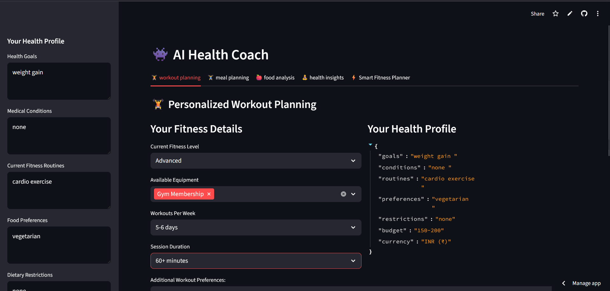

<div align="center">

# 🧠 AI Health Coach  
### 🚀 Personalized Fitness, Nutrition & Productivity Assistant

🌐 **Live App:** https://ai-coach-0.streamlit.app/  
📂 **GitHub Repo:** https://github.com/raja05sanwal/ai-coach  


</div>

---

## 📌 Overview

**AI Health Coach** is an AI-powered web application that generates:

🏋️ Personalized workout plans  
🥗 Smart diet recommendations  
📊 Health insights & recovery score  
⏱ Productivity routines  

Designed especially for **students & busy individuals** who want affordable and practical fitness guidance.

---

## ✨ Features

- 🧠 AI-generated workout planning
- 🥗 Personalized vegetarian & custom diet planning
- 🔥 HIIT & Tabata support
- ⏱ Pomodoro productivity timer
- 📅 Downloadable fitness schedule
- 📊 Calorie calculator & macro analyzer
- 😴 Sleep & recovery score system
- 💧 Water intake tracking
- 📈 Progress dashboard
- 🎯 Goal-based planning (weight loss / gain / maintenance)

---

## 🖥️ App Screenshots

### 🔹 Personalized Workout Planner


### 🔹 Recovery Score & Progress Tracker


---

## 🛠 Tech Stack

| Category | Technology |
|----------|------------|
Frontend | Streamlit |
Backend | Python |
AI Model | Google Gemini |
Data Processing | Pandas |
Calendar Export | iCalendar |
Image Handling | PIL |
Other | JSON, Datetime |

---

## ⚙️ Installation

### 1️⃣ Clone the repository

```bash
git clone https://github.com/raja05sanwal/ai-coach.git
cd ai-coach

2️⃣ Install dependencies
pip install -r requirements.txt

3️⃣ Set your API key
GOOGLE_API_KEY=your_api_key_here

4️⃣ Run the application
streamlit run app.py

🧠 How It Works

1️⃣ Enter your health profile
2️⃣ Select your fitness goal
3️⃣ AI analyzes your data
4️⃣ Generates:

🏋️ Workout plan
🥗 Diet plan
😴 Recovery insights
⏱ Productivity routine

🎯 Use Cases
👨‍🎓 Students with limited time & budget
🏠 Home & gym workout users
⚖️ Weight gain / weight loss transformation
📚 Study + fitness balance

🔮 Future Scope
📱 Mobile responsive design
⌚ Smartwatch / wearable integration
📊 Advanced analytics dashboard
🌍 Multi-language support
🎙 Voice-based AI coach

👨‍💻 Author
Raja
If you like this project:

⭐ Star the repo
🍴 Fork it
📢 Share it

📜 License
This project is licensed under the MIT License.
